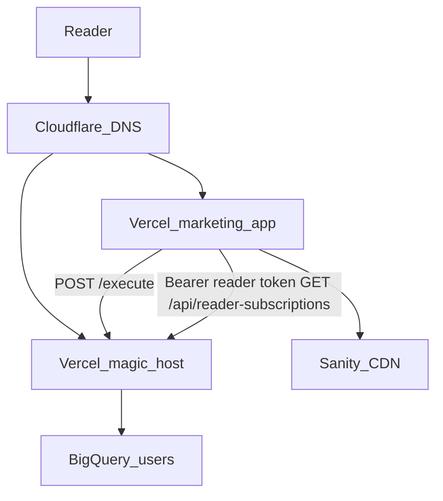

# Architecture

## High-level

1. **Marketing app** (`apps/*`): pages, Sanity-backed articles, ads, email-link landing behavior.
2. **Magic host** (`subscription-functions-copy` deploy, e.g. `magic.brand.com`): validates/executes subscribe / snooze / unsubscribe; can issue **short-lived reader tokens**; serves **authenticated** subscription snapshot for profile pages.
3. **Sanity**: content; each publication typically has its **own** project.
4. **BigQuery** (`analytics.users`): network-wide subscription map; **read from marketing apps is not allowed**; magic verifies token then reads BQ.

## Middleware

Homepage query parameters (`/?subscribed=true`, `/?poll`, …) are normalized by **`@publication-websites/platform-redirects`** and redirected to internal routes (`/subscribed`, `/poll`, …). Each app can override target paths via a route map if a brand needs different URLs later.

## Reader profile flow

1. Browser calls **`POST …/execute`** (via `executeAction` in `@publication-websites/magic-client`).
2. If `READER_TOKEN_SECRET` is set on magic, JSON may include **`readerToken`**; the client stores it in **`localStorage` (`magic_reader_token`)**.
3. Profile page calls **`GET https://magic.<brand>/api/reader-subscriptions`** with **`Authorization: Bearer <token>`**.
4. Magic verifies HMAC token, loads BQ row, returns **`subscribedBrands`**.

If no token (legacy flow), profile shows **this site’s** subscription from local state only.

## Planned reader auth (not built yet)

A fuller **magic-link sign-in for existing subscribers**, **Customer.io** transactional mail, and **network profile** UX is spec’d in **`docs/reader-magic-link-and-network-profile-spec.md`**. Implementing it will extend magic + marketing flows described above.

## Shared packages

| Package | Role |
|--------|------|
| `platform-redirects` | Homepage intent → redirect |
| `magic-client` | `/execute` fetch + token storage |
| `sanity-content` | GROQ + article mapping |
| `web-shell` | AdSense / Meta Script wrappers |
