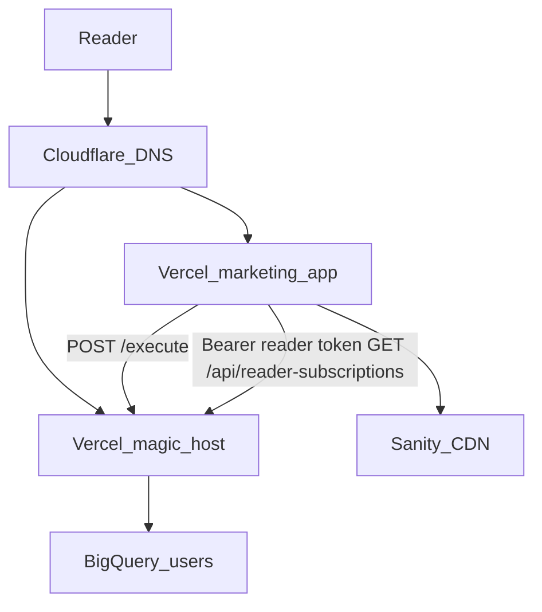

# Architecture

## High-level

```mermaid
flowchart TB
  Reader[Reader]
  CF[Cloudflare_DNS]
  VSite[Vercel_marketing_app]
  VMagic[Vercel_magic_host]
  Sanity[Sanity_CDN]
  BQ[BigQuery_users]

  Reader --> CF
  CF --> VSite
  CF --> VMagic
  VSite --> Sanity
  VSite -->|"POST /execute"| VMagic
  VSite -->|"Bearer reader token GET /api/reader-subscriptions"| VMagic
  VMagic --> BQ
```

1. **Marketing app** (`apps/*`): pages, Sanity-backed articles, ads, email-link landing behavior.
2. **Magic host** (`subscription-functions-copy` deploy, e.g. `magic.brand.com`): validates/executes subscribe / snooze / unsubscribe; can issue **short-lived reader tokens**; serves **authenticated** subscription snapshot for profile pages.
3. **Sanity**: content; each publication typically has its **own** project.
4. **BigQuery** (`analytics.users`): network-wide subscription map; **read from marketing apps is not allowed**; magic verifies token then reads BQ.

## Middleware

Homepage query parameters (`/?subscribed=true`, `/?poll`, …) are normalized by **`@publication-websites/platform-redirects`** and redirected to internal routes (`/subscribed`, `/poll`, …). Each app can override target paths via a route map if a brand needs different URLs later.

## Reader profile flow

1. Browser calls **`POST …/execute`** (via `executeAction` in `@publication-websites/magic-client`).
2. If `READER_TOKEN_SECRET` is set on magic, JSON may include **`readerToken`**; the client stores it in **`localStorage` (`magic_reader_token`)**.
3. Profile page calls **`GET https://magic.<brand>/api/reader-subscriptions`** with **`Authorization: Bearer <token>`**.
4. Magic verifies HMAC token, loads BQ row, returns **`subscribedBrands`**.

If no token (legacy flow), profile shows **this site’s** subscription from local state only.

## Reader sign-in + first-party giveaways (TPR)

- **Subscribe / Sign in:** marketing forms call magic `POST /api/giveaway` (`subscribe_or_signin`). Existing subscribers get a CIO `reader_sign_in_link` instead of a new-sub success path; redeem on `/sign-in`.
- **Giveaways (The Pickle Report):** config-driven campaigns in `apps/thepicklereport/src/config/giveaways.js`; pages `/giveaway/[slug]` and `/giveaway/[slug]/entered`. `listed: true` is required for sitemap, robots, and profile promo; unlisted campaigns stay reachable by URL only. Attribution codes + entries live in BigQuery (`giveaway_codes`, `giveaway_entries`); all writes/reads go through magic `/api/giveaway` (never BQ-from-browser). Sparkloop remains optional and orthogonal — giveaway credit keys off first-party `ref` only.
- ESP merge tags + QA: **`docs/GIVEAWAYS.md`**. Broader magic-link profile spec: **`docs/reader-magic-link-and-network-profile-spec.md`**.

## Shared packages

| Package | Role |
|--------|------|
| `platform-redirects` | Homepage intent → redirect |
| `magic-client` | `/execute` fetch + token storage |
| `sanity-content` | GROQ + article/recipe/slang/vault mapping (`createArticleQueries`, `createRecipeQueries`, `createSlangEntryQueries`, `createVaultIssueQueries`) |
| `shared-ads` | Static cross-promo creatives + Airtable house-ads fetch; **`brand-paths`** maps brand → `/article` / `/recipe` / `/word` |
| `web-shell` | AdSense / Meta Script wrappers |

## Publications in this repo

Marketing apps under `apps/` include Hookup Lists, The Pickle Report, The Kiss and Tell, The ’90s Parent, Eyeballer’s Cookbook, Hipspeak, From the Vault (Heeb), and **Hard Resets** (`apps/hardresets`, Sanity `0vm5rx64`, magic `magic.hardresets.com`). Env checklist: [`HARDRESETS_VERCEL_ENV.md`](./HARDRESETS_VERCEL_ENV.md). Hipspeak env: [`HIPSPEAK_VERCEL_ENV.md`](./HIPSPEAK_VERCEL_ENV.md).

**New brand launch:** follow [`LAUNCH_PLAYBOOK.md`](./LAUNCH_PLAYBOOK.md) (and update it when adding reusable network features).
