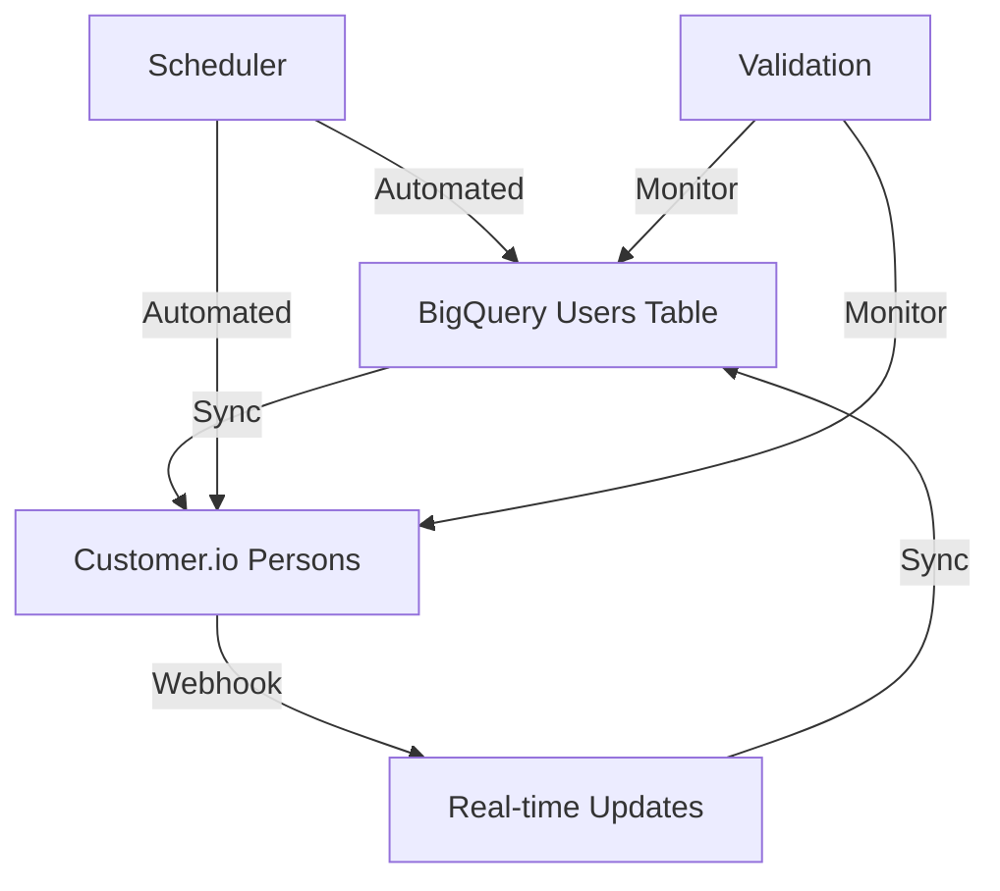

# BigQuery ↔ Customer.io Integration Guide

This guide covers the complete bidirectional integration system between BigQuery and Customer.io for your subscription management platform.

## 🏗️ Architecture Overview

The integration system consists of four main components:

1. **BigQuery → Customer.io Sync** (`bq-to-cio-sync.js`)
2. **Customer.io → BigQuery Sync** (`cio-to-bq-sync.js`) 
3. **Real-time Webhook Handler** (`cio-webhook.js`)
4. **Automated Scheduler & Monitor** (`sync-scheduler.js`)

## 📊 Data Flow



## 🚀 Quick Setup

### 1. Environment Variables

Add these to your `.env` file:

```bash
# Existing variables (already configured)
CIO_SITE_ID=your_site_id
CIO_API_KEY=your_api_key
CIO_TRACK_URL=https://track.customer.io/api/v2
GCP_PROJECT_ID=unaffiliated-data
GCP_SERVICE_ACCOUNT_KEY={"type":"service_account",...}

# New integration variables
CIO_WEBHOOK_SECRET=your_webhook_secret

# Sync configuration
BQ_TO_CIO_SYNC_INTERVAL=60          # minutes
CIO_TO_BQ_SYNC_INTERVAL=30          # minutes
VALIDATION_INTERVAL=240              # minutes
BQ_TO_CIO_BATCH_SIZE=100
CIO_TO_BQ_BATCH_SIZE=100
BQ_TO_CIO_LIMIT=1000
CIO_TO_BQ_LIMIT=1000

# Monitoring thresholds
ERROR_RATE_THRESHOLD=0.05            # 5%
SYNC_TIME_THRESHOLD=300000           # 5 minutes
VALIDATION_ISSUES_THRESHOLD=10

# Alert channels (optional)
ALERT_WEBHOOK_URL=https://your-alerts.com/webhook
ALERT_EMAIL=alerts@yourcompany.com
SLACK_WEBHOOK_URL=https://hooks.slack.com/services/...
```

### 2. Vercel Configuration

Update your `vercel.json` to include the new endpoints:

```json
{
  "rewrites": [
    {
      "source": "/",
      "destination": "/api/magic-link"
    },
    {
      "source": "/unsubscribe",
      "destination": "/api/magic-link"
    },
    {
      "source": "/api/cio-webhook",
      "destination": "/api/cio-webhook"
    },
    {
      "source": "/api/sync-status",
      "destination": "/api/sync-scheduler"
    },
    {
      "source": "/api/trigger-sync",
      "destination": "/api/sync-scheduler"
    }
  ]
}
```

### 3. Customer.io Webhook Setup

1. Go to Customer.io Settings → Integrations → Webhooks
2. Add new webhook:
   - **URL**: `https://your-deployment.vercel.app/api/cio-webhook`
   - **Events**: `person.created`, `person.updated`
   - **Secret**: Use the same value as `CIO_WEBHOOK_SECRET`

## 🔄 Sync Operations

### BigQuery → Customer.io Sync

**Purpose**: Sync user data from BigQuery to Customer.io, creating brand relationships.

**Usage**:
```bash
# Manual sync (all users)
node api/bq-to-cio-sync.js sync-all

# Dry run
node api/bq-to-cio-sync.js sync-all --dry-run

# With limits
node api/bq-to-cio-sync.js sync-all --limit 500 --batch-size 50

# Specific users by email
node api/bq-to-cio-sync.js sync-emails user1@example.com user2@example.com
```

**What it does**:
- Fetches users from BigQuery `analytics.users` table
- Converts `subscriptions` JSON to Customer.io brand relationships
- Updates Customer.io person attributes (`subscribed_brands`, `unsubscribed_brands`)
- Creates relationships to brand objects

### Customer.io → BigQuery Sync

**Purpose**: Sync subscription changes from Customer.io back to BigQuery.

**Usage**:
```bash
# Manual sync (all persons)
node api/cio-to-bq-sync.js sync-all

# Dry run
node api/cio-to-bq-sync.js sync-all --dry-run

# Specific persons by ID
node api/cio-to-bq-sync.js sync-ids personId1 personId2
```

**What it does**:
- Fetches persons from Customer.io
- Converts brand relationships to BigQuery `subscriptions` format
- Updates BigQuery `analytics.users` table using MERGE statements
- Maintains data consistency

## 🔔 Real-time Webhooks

### Customer.io Webhook Handler

**Endpoint**: `/api/cio-webhook`

**Purpose**: Handle real-time updates from Customer.io for immediate BigQuery sync.

**Supported Events**:
- `person.created` - New person created
- `person.updated` - Person attributes or relationships changed

**Webhook Payload Example**:
```json
{
  "type": "person.updated",
  "data": {
    "id": "user_123",
    "attributes": {
      "email": "user@example.com",
      "subscribed_brands": {"thepicklereport": 1704873600000}
    },
    "cio_relationships": [
      {
        "identifiers": {
          "object_type_id": "1",
          "object_id": "The Pickle Report"
        }
      }
    ]
  }
}
```

## ⏰ Automated Scheduling

### Sync Scheduler

**Purpose**: Automatically run syncs and validations at configured intervals.

**Configuration**:
- **BQ → CIO**: Every 60 minutes (configurable)
- **CIO → BQ**: Every 30 minutes (configurable)  
- **Validation**: Every 4 hours (configurable)

**Usage**:
```bash
# Manual trigger
node api/sync-scheduler.js sync-bq-to-cio
node api/sync-scheduler.js sync-cio-to-bq
node api/sync-scheduler.js validate

# Check status
node api/sync-scheduler.js status
```

### Monitoring & Alerts

**Health Checks**:
- Sync success rates
- Processing times
- Data validation issues
- Error rates

**Alert Thresholds**:
- Error rate > 5%
- Sync time > 5 minutes
- Validation issues > 10

**Alert Channels**:
- Webhook notifications
- Slack integration
- Email alerts

## 🔍 Data Validation

### Consistency Checks

**Purpose**: Ensure data consistency between BigQuery and Customer.io.

**What it validates**:
- Subscription brand lists match
- User exists in both systems
- Relationship data is consistent
- Attribute values are synchronized

**Usage**:
```bash
# Run validation
node api/bq-to-cio-sync.js validate
node api/cio-to-bq-sync.js validate

# Check specific sample size
node api/bq-to-cio-sync.js validate --sample-size 200
```

**Validation Results**:
```json
{
  "issues": [
    {
      "userID": "user_123",
      "email": "user@example.com",
      "type": "subscription_mismatch",
      "bqBrands": ["thepicklereport", "themixedhome"],
      "cioBrands": ["thepicklereport"]
    }
  ],
  "totalChecked": 100
}
```

## 📊 Data Mapping

### Brand Name Mapping

| BigQuery Brand ID | Customer.io Brand Name |
|-------------------|------------------------|
| `thepicklereport` | The Pickle Report |
| `themixedhome` | The Mixed Home |
| `batmitzvahhorrorstories` | Bat Mitzvah Horror Stories |
| ... | ... |

### Subscription Data Format

**BigQuery Format**:
```json
{
  "thepicklereport": {
    "subscribed_timestamp": 1704873600000,
    "subSource": "magic_link"
  }
}
```

**Customer.io Format**:
```json
{
  "thepicklereport": 1704873600000
}
```

## 🛠️ API Endpoints

### Manual Sync Triggers

**POST** `/api/trigger-sync`

**Parameters**:
- `type`: `bq-to-cio`, `cio-to-bq`, or `validation`
- `dryRun`: `true` or `false` (optional)

**Example**:
```bash
curl -X POST "https://your-deployment.vercel.app/api/trigger-sync?type=bq-to-cio&dryRun=true"
```

### Status Check

**GET** `/api/sync-status`

**Response**:
```json
{
  "status": "healthy",
  "lastSync": {
    "bqToCIO": "2024-01-20T10:30:00Z",
    "cioToBQ": "2024-01-20T10:15:00Z",
    "validation": "2024-01-20T08:00:00Z"
  },
  "stats": {
    "bqToCIO": { "successful": 150, "failed": 5, "total": 155 },
    "cioToBQ": { "successful": 200, "failed": 2, "total": 202 }
  },
  "health": {
    "bqToCIO": {
      "lastRun": "2024-01-20T10:30:00Z",
      "nextRun": "2024-01-20T11:30:00Z",
      "successRate": 0.968
    }
  }
}
```

## 🔧 Troubleshooting

### Common Issues

#### 1. Sync Failures
```bash
# Check logs
vercel logs --follow

# Run manual sync with dry run
node api/bq-to-cio-sync.js sync-all --dry-run
```

#### 2. Data Inconsistencies
```bash
# Run validation
node api/bq-to-cio-sync.js validate --sample-size 50

# Check specific user
node api/cio-to-bq-sync.js sync-ids specific_user_id
```

#### 3. Webhook Issues
```bash
# Test webhook endpoint
curl -X POST "https://your-deployment.vercel.app/api/cio-webhook" \
  -H "Content-Type: application/json" \
  -d '{"type":"person.updated","data":{"id":"test"}}'
```

### Debug Commands

```bash
# Check sync status
node api/sync-scheduler.js status

# Manual validation
node api/sync-scheduler.js validate

# Test specific sync
node api/sync-scheduler.js sync-bq-to-cio
```

## 📈 Monitoring Dashboard

### Key Metrics to Track

1. **Sync Success Rates**
   - BQ → CIO: Target > 95%
   - CIO → BQ: Target > 95%

2. **Processing Times**
   - BQ → CIO: Target < 5 minutes
   - CIO → BQ: Target < 3 minutes

3. **Data Consistency**
   - Validation issues: Target < 5%
   - Missing users: Target 0%

4. **Error Rates**
   - API errors: Target < 1%
   - Sync failures: Target < 5%

### Alerting Rules

```yaml
# Example alerting rules
alerts:
  - name: "High Sync Error Rate"
    condition: "error_rate > 0.05"
    severity: "warning"
    
  - name: "Sync Timeout"
    condition: "sync_duration > 300000"
    severity: "warning"
    
  - name: "Data Validation Issues"
    condition: "validation_issues > 10"
    severity: "critical"
```

## 🚀 Production Deployment

### 1. Initial Sync

```bash
# Run full sync from BigQuery to Customer.io
node api/bq-to-cio-sync.js sync-all

# Validate the sync
node api/bq-to-cio-sync.js validate
```

### 2. Enable Webhooks

1. Configure Customer.io webhook
2. Test webhook endpoint
3. Monitor real-time syncs

### 3. Set Up Monitoring

1. Configure alert channels
2. Set up dashboards
3. Test alerting system

### 4. Schedule Automation

1. Set up cron jobs or scheduled functions
2. Configure sync intervals
3. Monitor automated runs

## 📚 Best Practices

### Data Management

1. **Always use MERGE statements** for BigQuery updates
2. **Batch operations** to avoid rate limits
3. **Validate data** before and after syncs
4. **Monitor error rates** and alert on issues

### Performance

1. **Use appropriate batch sizes** (100-200 records)
2. **Implement retry logic** for failed operations
3. **Cache frequently accessed data**
4. **Monitor API rate limits**

### Security

1. **Validate webhook signatures**
2. **Use environment variables** for secrets
3. **Implement proper error handling**
4. **Log all operations** for audit trails

## 🔄 Maintenance

### Daily Tasks

- [ ] Check sync status
- [ ] Review error logs
- [ ] Monitor alert notifications

### Weekly Tasks

- [ ] Run full validation
- [ ] Review sync performance
- [ ] Update documentation

### Monthly Tasks

- [ ] Analyze sync patterns
- [ ] Optimize batch sizes
- [ ] Review alert thresholds
- [ ] Update dependencies
